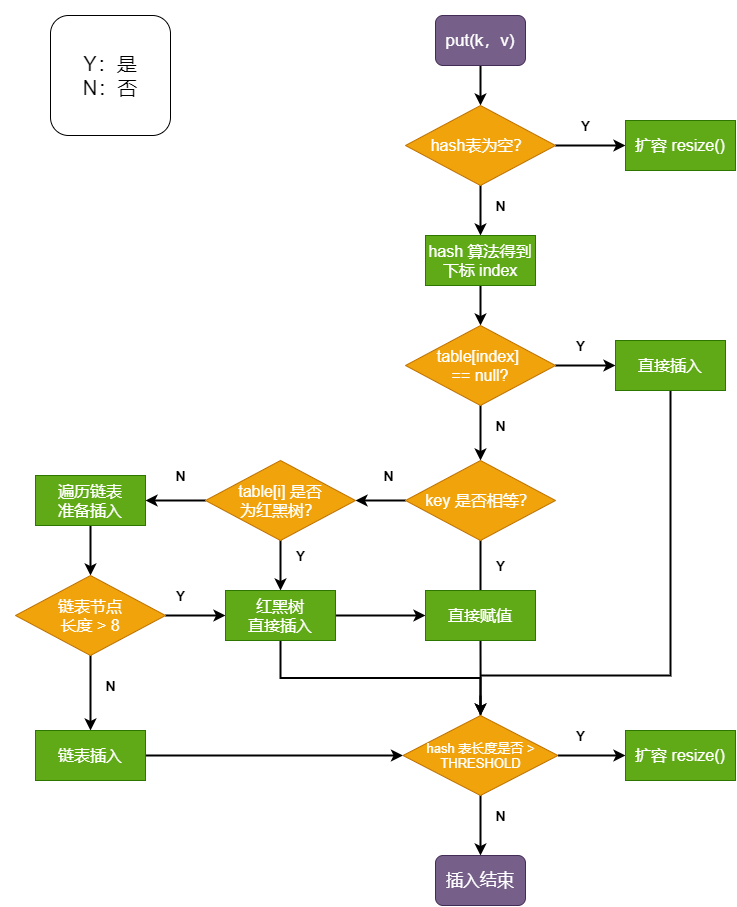

### HashMap的底层数据结构

HashMap是我们非常常用的数据结构，由**数组和链表组合构成**的数据结构。
本身所有的位置都为null，在put插入的时候会根据key的hash去计算一个index值。
哈希本身就存在概率性，hash有一定的概率会一样，不同的key极端情况会hash到一个值上，那就形成了链表。

### HashMap的存取原理

存：

1. 根据key计算出hashCode，然后找到相应的bucket来存储数据
2. 若hashCode一样，发生了hash碰撞。因为底层是数组+链表，所以每个bucket是一个链表，循环链表中的元素，用equals方法对比key值，若已存在则替换，没有的话在尾部插入即可。

取：

1. get时，先计算key的hashCode
2. 找到对应的bucket
3. 调用key的equals方法来找到对应的数据



### Java7和Java8的区别

**发生hash冲突时：**
JDK7：发生hash冲突时，新元素插入到链表头中
JDK8：发生hash冲突后，会优先判断该节点的数据结构式是红黑树还是链表，如果是红黑树，则在红黑树中插入数据；如果是链表，则将数据插入到链表的尾部并判断链表长度是否大于8，如果大于8要转成红黑树。
**扩容时 ：**
JDK7：在扩容resize过程中，采用单链表的头插入方式
JDK8：按旧链表的正序遍历链表、在新链表的尾部依次插入

### 如何保证哈希分布均匀

对key进行哈希运算，转换为二进制，与长度-1进行 & 运算（11为1，其他为0），得到的数字就是存的位置

- 与运算不会超过自己本身，若长度为2的幂，则为若干个1，正好与数组长度符合

### HashMap为什么是线程不安全的

java7：
扩容时，假设循环链表时，线程A的CPU时间片耗尽，然后线程B完成了扩容操作，反观线程A继续操作数据，会导致循环或丢失数据的问题
java8：
假设线程A、线程B进行put操作，发生了哈希碰撞，A线程判断完哈希碰撞后挂起，B线程完成了操作，当线程A继续运行时，已经跳过了判断哈希碰撞，所以会替换掉B线程中插入的值，造成数据覆盖
还有就是在hashMap的大小计算时，AB线程分别是挂起，运行完成，但是A线程的HashMap的大小还是在B未添加时的大小，所以两次put，数组大小只增加了1个，造成了数据覆盖

**死循环问题：**

### 有什么线程安全的类代替么

ConcurrentHashMap & Hashtable

### 什么时候扩容呢，怎么扩容

有两个因素：

- Capacity：HashMap当前长度。
- LoadFactor：负载因子，默认值0.75f。

**ps：当前长度 > Capacity \* LoadFactor时自动扩容到两倍**

分两步

- 扩容：创建一个新的Entry空数组，长度是原数组的2倍。
- ReHash：遍历原Entry数组，把所有的Entry重新Hash到新数组。

**ps：扩容后key计算的index值会发生变化，所以需要重新添加到新数组中**

### 初始化大小为什么是16

1<<4就是16
位与运算比算数计算的效率高太多了，之所以选择 16，是为了服务将 Key 映射到 index 的算法。
公式（Length 是 HashMap 的长度）：**HashCode（Key） & （Length- 1）**

举个例子，key 为 "book" 的十进制为 3029737 那二进制就是 101110001110101110 1001 HashMap 长度是默认的 16，length - 1 的结果。十进制 : 15；二进制 : 1111
把以上两个结果做与运算：101110001110101110 1001 & 1111 = 1001；1001 的十进制 = 9, 所以 index=9。

### 为什么重写equals方法的时候需要重写hashCode方法呢？

Java 中，所有的对象都是继承于 Object 类。Ojbect 类中有两个方法 equals、hashCode，这两个方法都是用来比较两个对象是否相等的。
先来看看 equals 方法：

```java
public boolean equals(Object obj) {
    return (this == obj);
}
```

在未重写 equals 方法，他其实就是 == 。有以下两个特点：

- 对于值对象，== 比较的是两个对象的值
- 对于引用对象，== 比较的是两个对象的地址

看回 put 方法的源码：**HashMap 是通过 key 的 hashcode 去寻找地址 index 的。如果 index 一样就会形成链表**，也即是"狗哥"和"阿狗"是有可能在同一个位置上。
前面的 get 方法说过：**当哈希冲突时我们不仅需要判断 hash 值，还需要通过判断 key 值是否相等，才能确认此元素是不是我们想要的元素**。我们去 get 首先是找到 hash 值一样的，那怎么知道你想要的是那个对象呢？**没错，就是利用 equals 方法**，如果重写 hashCode 方法，不写 equals 方法，当发生 hash 冲突，hashcode 一样时，就不知道取哪个对象了。

### 为什么树化是 8，退树化是 6？

红黑树平均查找长度为 log(n)，长度为 8 时，查找长度为 3，而链表平均查找长度为 n/2；也就是 8 除以 2；查找长度链表大于树，转化为树，效率更高。
当为 6 时，树：2.6；链表：3。链表 > 树。这时理应也还是树化，但是树化需要时间，为了这点效率牺牲时间是不划算的。

### 什么是加载因子？加载因子为什么是 0.75 ？

加载因子也叫扩容因子或负载因子，用来判断什么时候进行扩容的，假如加载因子是 0.5，HashMap 的初始化容量是 16，那么当 HashMap 中有 16*0.5=8 个元素时，HashMap 就会进行扩容。

- 当加载因子设置较大时，扩容门槛提高，扩容发生频率低，占用的空间小，但此时发生 Hash 冲突的几率就会提升，因此需要更复杂的数据结构来存储元素，这样对元素的操作时间就会增加，运行效率也会降低；
- 当加载因子设置较小时，扩容门槛降低，会占用更多的空间，此时元素的存储就比较稀疏，发生哈希冲突的可能性就比较小，因此操作性能会比较高。